# 📖 Guia de Operação - Extrator de Hashes e Metadados (ERS-IC/SP-NIC) - v.6.0.0

Este manual orienta o usuário sobre como utilizar as funcionalidades da ferramenta para garantir a integridade e a profundidade da análise pericial.

---

## 0. Primeiros Passos: Download, Extração e Execução

O **Extrator de Hashes e Metadados (ERS-IC/SP-NIC)** é uma ferramenta portátil. Isso significa que não é necessário instalá-lo no sistema: basta baixar o arquivo, descompactá-lo e executar o programa.
> **DICA:** Este programa pode ser executado a partir de unidades móveis, como _pendrives_..

### Como Baixar o Arquivo e Descompactá-lo 
1. [CLIQUE AQUI PARA BAIXAR A VERSÃO MAIS RECENTE (v.6.0.0)](https://github.com/eduardo-rsilva/extrator_hashes_metadados/releases/download/v.6.0.0/Extrator_ERS-IC-SP-NIC_v6.0.0.zip) 
2. Localize o arquivo `.zip` baixado no seu computador (geralmente na pasta **Downloads**).
2. Clique com o botão direito do mouse sobre o arquivo e selecione **"Extrair Tudo..."**.
3. Escolha uma pasta de destino e conclua a extração.
> **IMPORTANTE:** descompacte o arquivo antes de executar o programa. Ele não funciona diretamente a partir do arquivo compactado.
> 

> **OBSERVAÇÃO:** na página de [RELEASES DO PROJETO](https://github.com/eduardo-rsilva/extrator_hashes_metadados/releases) é possível consultar versões anteriores do programa.

### Como Rodar o Programa
1. Abra a pasta onde os arquivos foram extraídos.
2. Localize o arquivo executável principal: `extrator_hashes_metadados.exe`.
3. Dê um clique duplo sobre ele para abrir a interface gráfica.
> **AVISO:** não mova o executável para fora da pasta extraída, pois ele depende dos demais arquivos que o acompanham no mesmo diretório. Se desejar facilitar o acesso, crie um atalho (botão direito sobre o arquivo e "Criar atalho") e copie-o para a Área de Trabalho em vez de mover o arquivo.

> **IMPORTANTE:** o programa requer um sistema operacional **Windows de 64 bits**.

> **OBSERVAÇÃO SOBRE ATUALIZAÇÕES:** O programa verifica automaticamente a disponibilidade de novas versões na internet sempre que é iniciado. Se uma atualização for encontrada, uma barra de alerta amarela aparecerá no topo da janela principal.
> > Ao clicar em **"✨ CLIQUE AQUI PARA ATUALIZAR AUTOMATICAMENTE"** (versão 5.2.0 ou superior), o extrator baixará e preparará a nova versão em uma pasta ao lado da pasta da versão atual.
> 
> > Você também pode passar o mouse sobre o alerta para ler um resumo das novidades da versão ou clicar no link secundário para ler as notas completas no GitHub.

### Selecione o Layout
O programa tem dois layouts disponíveis: **Visual Moderno** e **Visual Clássico**:
    <figure>
      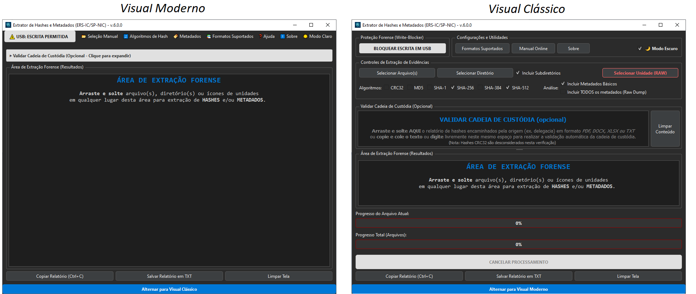
      <figcaption align="center"><i>Layouts do programa: Moderno e Clássico.</i></figcaption>
    </figure>

Na borda inferior do programa, há um botão que permite alternar entre os layouts:
    <figure>
      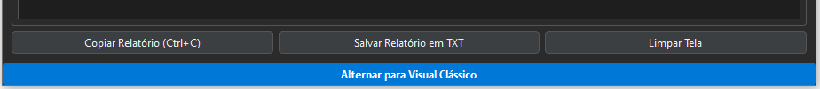
      <figcaption align="center"><i>Botão para alternar entre os layouts Clássico e Moderno.</i></figcaption>
    </figure>

> **IMPORTANTE:** O manual a seguir tem imagens referentes ao **Visual Clássico**. As funções abaixo explicadas podem ter seus análogos no menu do **Visual Moderno** facilmente encontrados pelo usuário.

---

## 1. Proteção Forense (v.6.0.0 em diante): Bloqueador de Escrita USB (Software Write-Blocker)
Antes de processar qualquer evidência via USB, é altamente recomendável ativar o bloqueio de escrita para evitar alterações acidentais pelo sistema operacional.

* **Ativação:** Na interface principal, localize o botão de Bloqueio de Escrita USB.
* **Elevação de Privilégio:** O sistema solicitará acesso de Administrador (UAC) apenas para alterar a chave de registro `WriteProtect` do Windows, mantendo o resto do programa rodando de forma segura como usuário comum.
* **Monitoramento e Segurança:** O programa monitora a chave de registro continuamente. Caso você tente fechar o Extrator com o bloqueio ainda ativo, uma tela de segurança aparecerá para alertá-lo e garantir que o seu computador não fique bloqueado acidentalmente após o uso.

    <figure>
      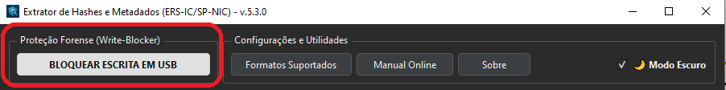
      <figcaption align="center"><i>Botão para bloqueio de escrita em unidades conectadas via USB.</i></figcaption>
    </figure>
___

## 2. Processamento de Arquivos e Pastas
A forma mais rápida de utilizar o programa é através da técnica de "arrastar e soltar" (Drag & Drop).

* **Configuração:** Selecione os algoritmos de hash desejados no painel superior (SHA-256 e SHA-512 são recomendados e vêm marcados por padrão).
* **Incluir Subdiretórios:** Selecione esse campo se quiser analisar todos os arquivos contidos em todos os subdiretórios contidos no diretório selecionado.
> **Observação:** no **Visual Moderno**, uma caixa de mensagens surgirá para confirmar se o usuário quer incluir subdiretórios. 
* **Seleção de Metadados:** Selecione **"Incluir Metadados Básicos"**, que é uma seleção dos metadados mais utilizados, ou **"Incluir TODOS os metadados (Raw Dump)"** para ver todos os itens disponíveis encontrados.

    <figure>
      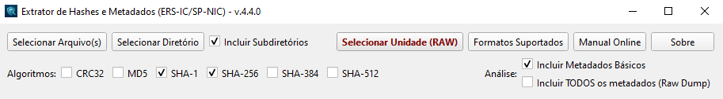
      <figcaption align="center"><i>Área de 'Controles de Extração de Evidências'.</i></figcaption>
    </figure>

 

* **Ação**: Arraste seus **arquivos, diretórios ou ícones de unidade** para qualquer área da janela principal.
    > **DICA:** se for arrastado o ícone da unidade completa (ex.: F:, G: etc), o relatório de hash também incluirá o "serial number" daquela unidade.

    <figure>
      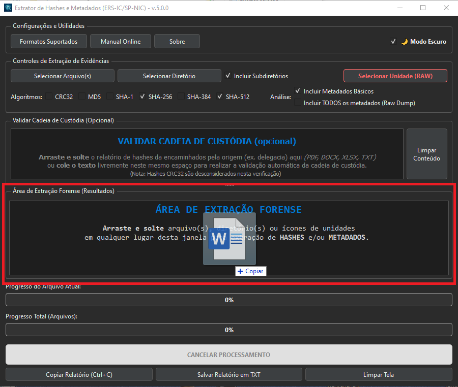
      <figcaption align="center"><i>Interface principal destacando a área para drag-and-drop de arquivos, diretórios ou ícones de unidade a serem analisados</i></figcaption>
    </figure>

 

* **Segurança:** O software aplicará automaticamente o **File Lock** para impedir que outros processos alterem o arquivo enquanto o hash é calculado.

---

## 3. Aquisição Forense e Hash RAW (Bit-a-Bit)
Para processar mídias físicas ou volumes lógicos em baixo nível, utilize o módulo RAW.

### Bloqueador de Escrita USB (Recomendado)
Antes de iniciar a aquisição de um dispositivo USB, ative o Software Write-Blocker diretamente na interface principal. O sistema pedirá elevação de privilégio (UAC) apenas para essa ação. O Extrator possui uma trava de segurança que impedirá o fechamento acidental do programa enquanto o bloqueio estiver ativo, oferecendo opções para desbloquear o sistema de forma segura.

1.  **Acesso:** Clique em **Selecionar Unidade (RAW)**.

    <figure>
      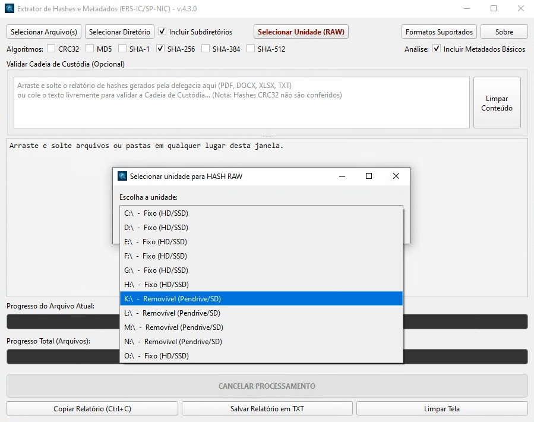
      <figcaption align="center"><i>Seletor de Unidade para HASH RAW: CDs, DVDs, Volumes Lógicos e Hardwares (mesmo com tamanhos desconhecidos) são listados.</i></figcaption>
    </figure>

 

2.  **Elevação de Privilégio:** O sistema solicitará acesso de Administrador (UAC) para interagir diretamente com o hardware.

    <figure>
      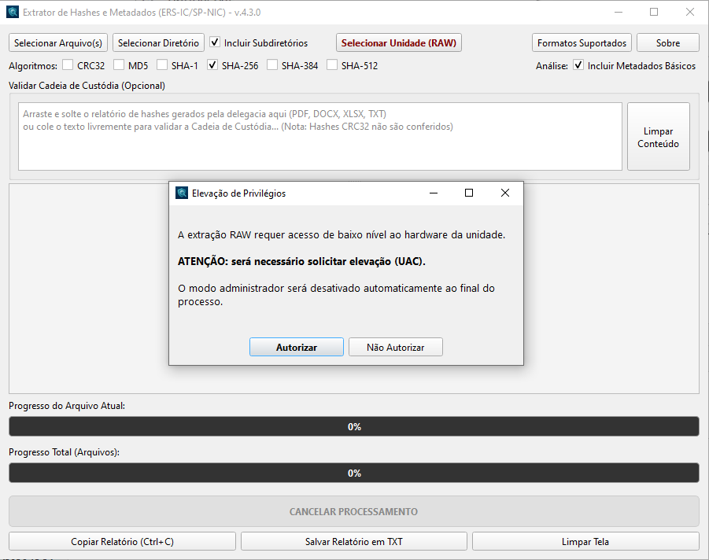
      <figcaption align="center"><i>Mensagem solicitando elevação para privilégios de administrador (UAC).</i></figcaption>
    </figure>

 

3.  **Metodologia:** Escolha entre **Disco Físico Inteiro** (captura MBR/GPT e espaço não alocado) ou apenas o **Volume Lógico**.

    <figure>
      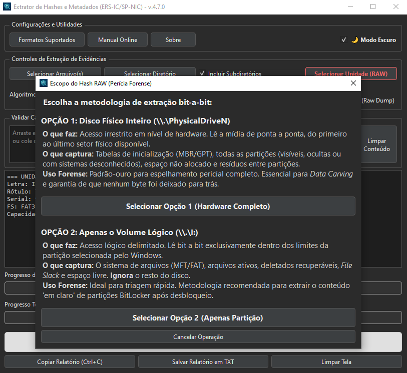
      <figcaption align="center"><i>Seletor do tipo de extração.</i></figcaption>
    </figure>

 

4.  **Imagem Forense:** Você pode optar por gerar apenas o hash da unidade ou por simultaneamente gerar uma imagem (cópia bit-a-bit) nos formatos **RAW (.dd)** ou **Expert Witness (.E01)**.

    <figure>
      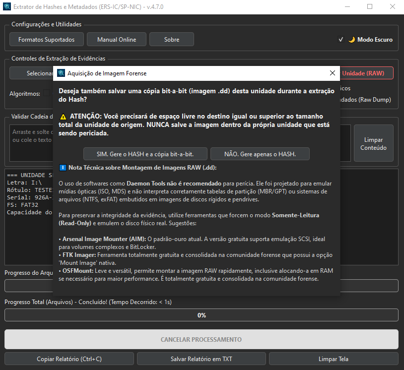
      <figcaption align="center"><i>Seletor para aquisição simultânea de cópia bit-bit-bit.</i></figcaption>
    </figure>
     

     

    <figure>
      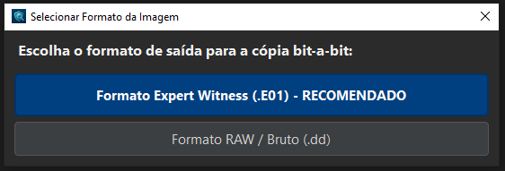
      <figcaption align="center"><i>Seletor do formato para aquisição da cópia bit-bit-bit.</i></figcaption>
    </figure>
     
    
     

    <figure>
      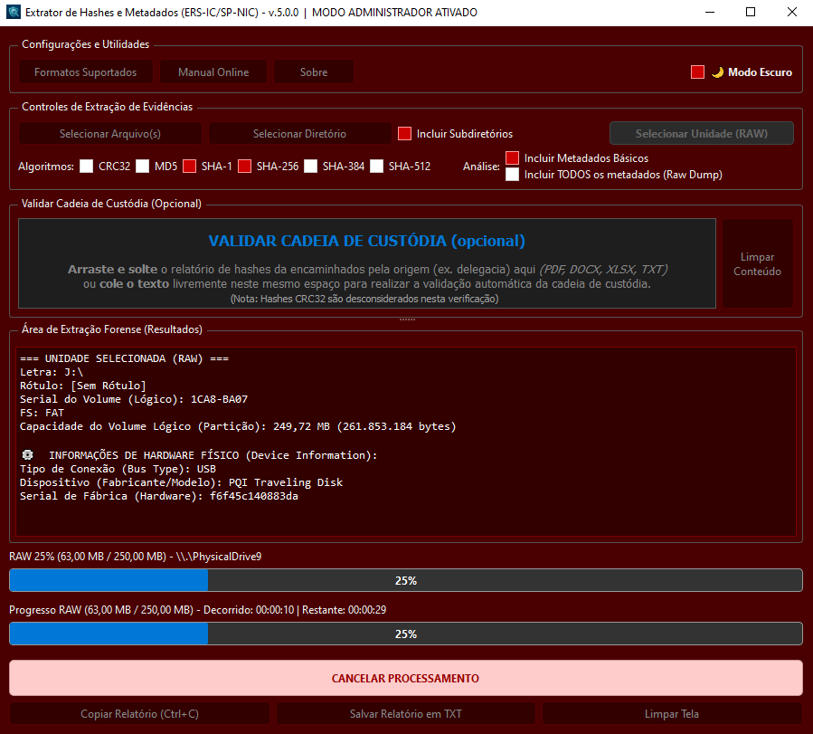
      <figcaption align="center"><i>Quando o MODO ADMINISTRADOR está ativado, há um demarcador visual evidente para isso: interface gráfica na cor vermelha.</i></figcaption>
    </figure>
---

## 4. Validação da Cadeia de Custódia
O extrator permite auditar listagens de hashes recebidas em laudos de terceiros ou documentos de custódia.

* **Como operar:** Arraste o arquivo de referência (PDF, DOCX, XLSX ou TXT) para a caixa superior "Validar Cadeia de Custódia". Você também pode copiar e colar o contéudo nesse mesmo campo.

    <figure>
      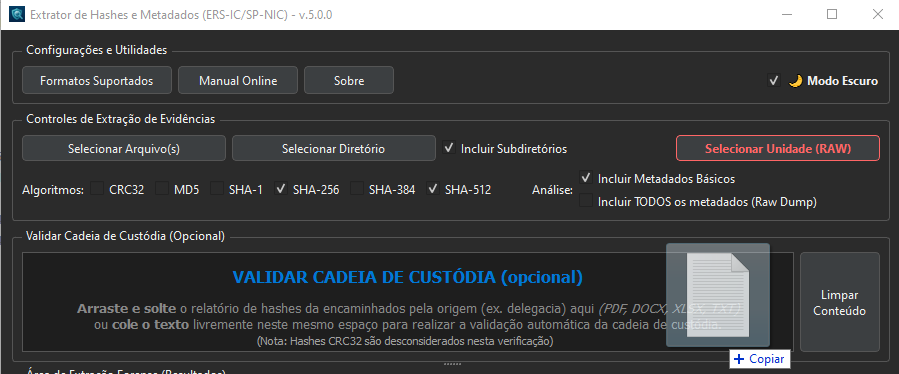
      <figcaption align="center"><i>Área para drag-and-drop de arquivos com hashes calculados pelo requisitante do exame para validação de cadeia de custódia.</i></figcaption>
    </figure>

 

* **Análise Reversa:** O software buscará automaticamente no texto o hash do arquivo que está sendo processado, ignorando artefatos de formatação e espaços invisíveis.
* **Resultado:** O log indicará, em cada arquivo analisado, um dos seguintes status:
  * **✅ CONFERE:** se todos os hashes forem encontrados na listagem informada pelo requisitante do exame.
  * **⚠️ ALERTA PARCIAL:** se apenas alguns dos hashes daquele arquivo forem encontrados.
  * **❌ DIVERGÊNCIA:** se nenhum hash calculado constar na listagem informada pelo requisitante do exame.
* Ao final, é gerado um **RESUMO DA VALIDAÇÃO DE CUSTÓDIA** que sintetiza os resultados acima:

    <figure>
      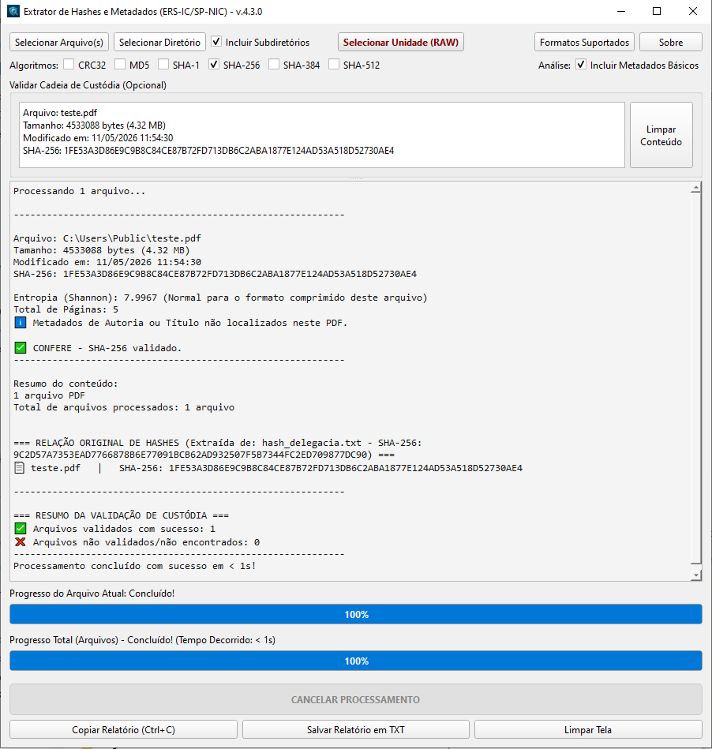
      <figcaption align="center"><i>Neste exemplo hipotético, o requisitante do exame enviou uma listagem de hashes que foi copiada na região 'Validação Cadeia de Custódia'. A extração dos hashs dos arquivos analisados foi comparada automaticamente com a referência recebida.</i></figcaption>
    </figure>
---
    
## 5. Analisando Metadados e Alertas Periciais
Ao marcar a opção "Incluir Metadados Básicos", o programa realiza uma extração dos metadados mais utilizados através de diversas bibliotecas forenses. A opção "Incluir TODOS os metadados (Raw Dump)" vai listar todos os itens disponíveis encontrados:

* **Multimídia:** Coordenadas GPS (com link para mapas), marcas de câmeras e análise avançada de FPS (taxa de quadros) em vídeos.
* **ADS (NTFS):** O programa alerta sobre dados ocultos em fluxos de dados alternativos e fornece comandos PowerShell prontos para extração de payloads.
* **Redes Sociais:** Identifica se o arquivo foi "lavado" (*metadata stripping*) por plataformas como WhatsApp, Telegram ou Facebook.
* **Entropia:** Valores de Entropia de Shannon acima de 7.9 indicam alta probabilidade de criptografia ou arquivos *packed*.

    <figure>
      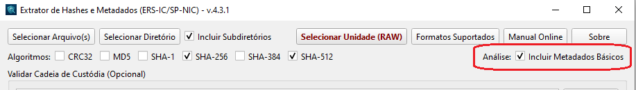
      <figcaption align="center"><i>Seletor para inclusão de metadados.</i></figcaption>
    </figure>

---

## 6. Finalização e Relatórios
Ao término do processamento, revise o resumo final para consolidar a perícia:

* **Dados de Geolocalização:** Caso sejam encontrados dados de geolocalização (GPS) em um ou mais arquivos, eles serão agrupados na janela **"Coordenadas GPS Encontradas!"**. Os hiperlinks "Abrir Localização no Google Maps" levam diretamente àquela localização no site Google Maps no browser padrão do usuário. Também é possível ver os primeiros 10 pontos encontrados em link direto no Google Maps (modo Rota), copiar a lista de links gerados em texto puro ou exportar o resultado em formato `.kml` para visualização no "Google Earth" ou no "Google My Maps".

    <figure>
      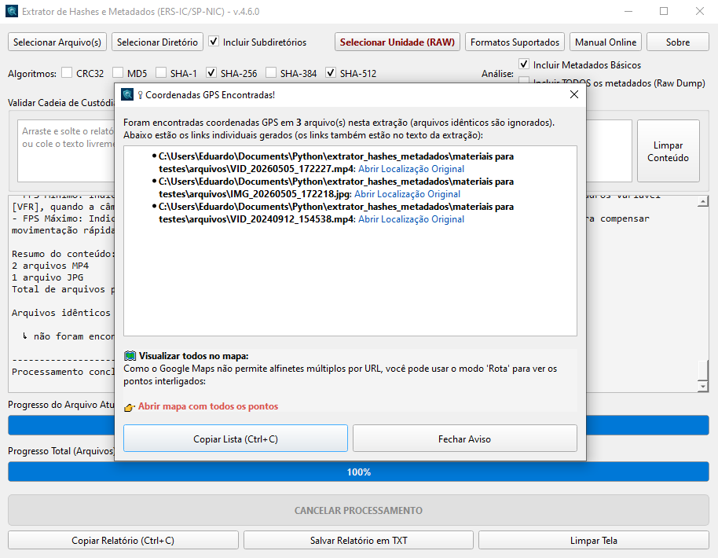
      <figcaption align="center"><i>Essa janela agrupa os hiperlinks das coordenadas GPS encontradas.</i></figcaption>
    </figure>

 

* É possível exportar as coordenadas GPS encontradas para um arquivo no formato '.kml', padrão do Google Earth e do Google MyMaps (modo de acesso detalhado no botão "Instruções para visualizar arquivos KML").

    <figure>
      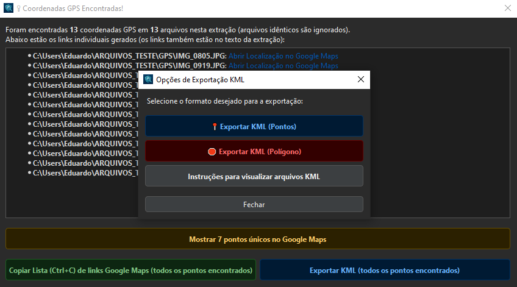
      <figcaption align="center"><i>É possível selecionar o formato de Pontos ou de Polígono (disponível a partir de 3 pontos encontrados). </i></figcaption>
    </figure>
     

     
  
    <figure>
      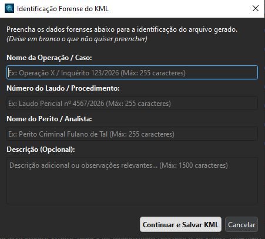
      <figcaption align="center"><i>É possível registrar no arquivo KML informações que identificam a extração. Essas informações ficarão visíveis na interface do Google Earth ou do Google My Maps. </i></figcaption>
    </figure>
     
  
     
    
    <figure>
      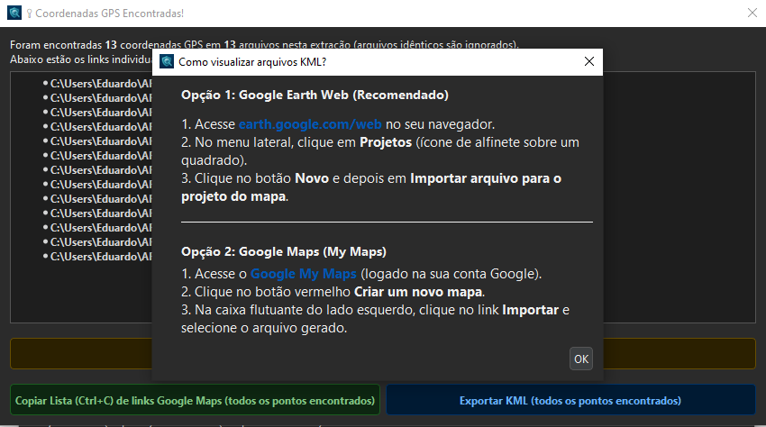
      <figcaption align="center"><i>Instruções para visualização de arquivos KML. </i></figcaption>
    </figure>

 

* **Arquivos Duplicados:** O programa agrupa automaticamente arquivos idênticos baseando-se no cruzamento de hashes criptográficos.

    <figure>
      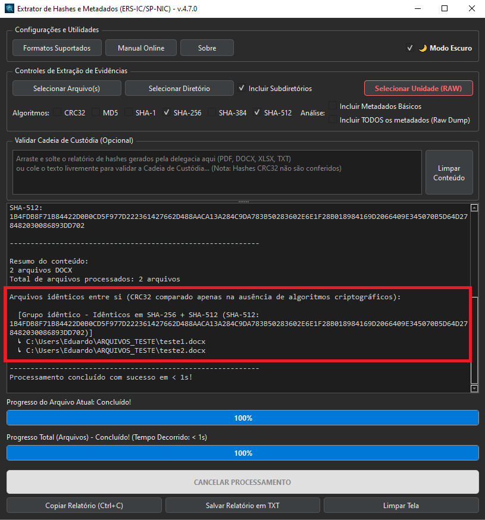
      <figcaption align="center"><i>O relatório agrupa os arquivos duplicados.</i></figcaption>
    </figure>

 

* **Exportação:** Clique em **Salvar Relatório em TXT** para arquivar os resultados ou em **Copiar Relatório (Ctrl+C)** e transfira esse conteúdo usando "Ctrl+V" em algum documento de texto. O tempo de execução é registrado no log.

    <figure>
      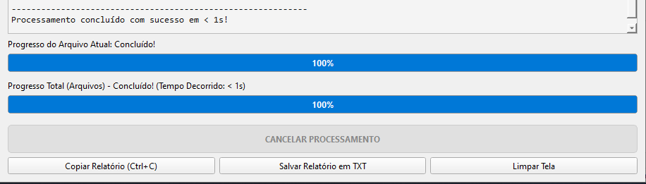
      <figcaption align="center"><i>Botões para salvar ou copíar o relatório gerado.</i></figcaption>
    </figure>

 

* **Auditoria:** O relatório inclui a assinatura SHA-256 do código-fonte utilizado, garantindo a transparência do algoritmo.

    <figure>
      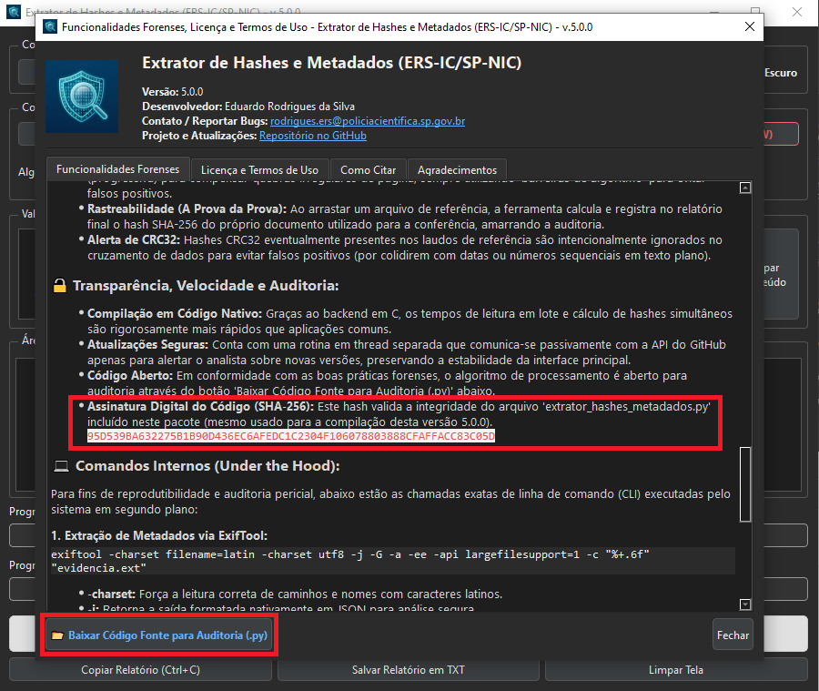
      <figcaption align="center"><i>Assinatura digital do código-fonte que acompanha o pacote do programa.</i></figcaption>
    </figure>

 
